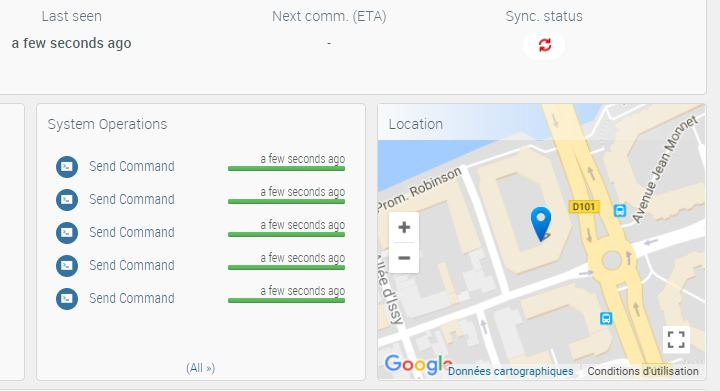

Legato helper lib to Push the current Location to AirVantage
============================================================

This helper library is wrapping Legato le_pos, le_posCtrl and le_avdata services to provide 2 key functions:
- Retrieve the current location (2D or 3D) : position_GetLocation()
- Push the current location to AirVantage : position_PushLocation()

Sample
--------------
positionSample, is a simple Legato app making using of this helper to:

Push the current location to AirVantage. The publishing interval varies depending on the gnss fix state

Position as updated in AirVantage:

